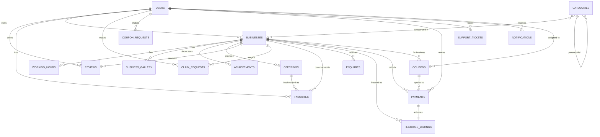
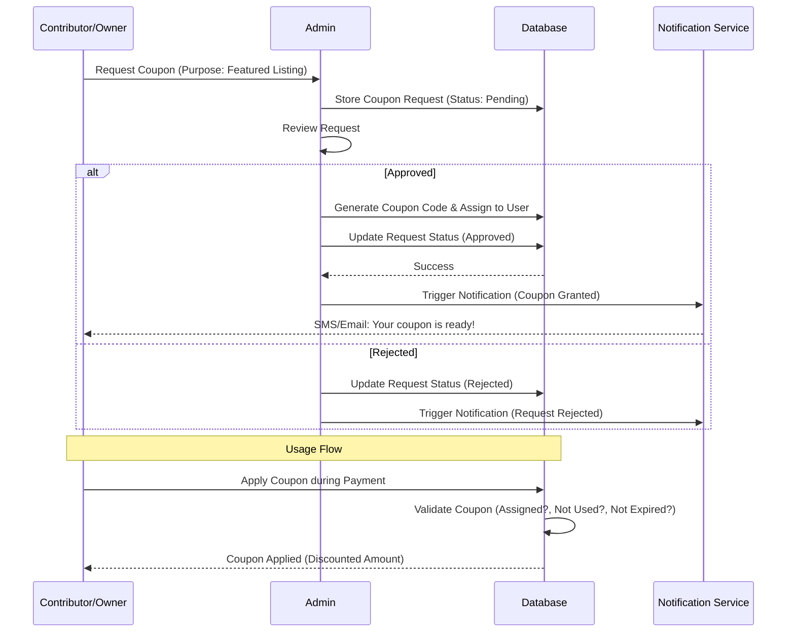
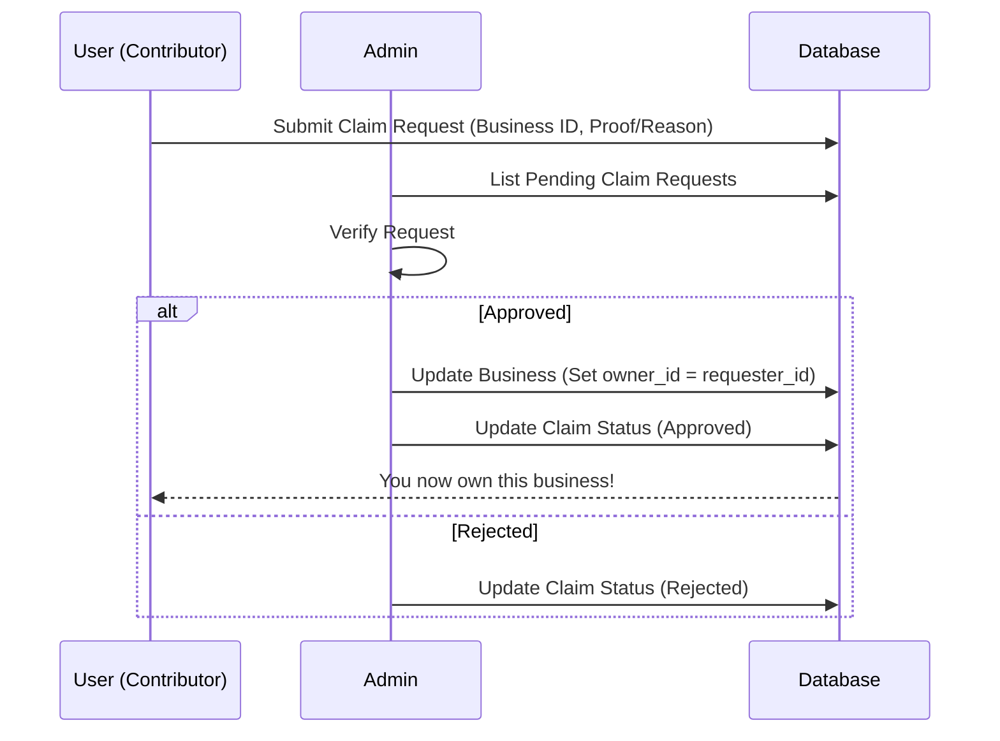
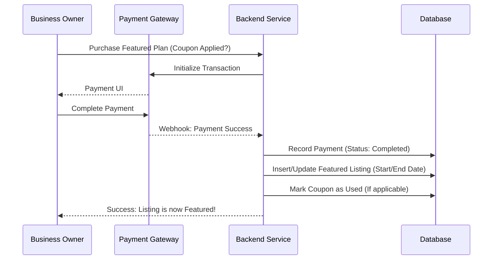

# OhoSearch System Design

## 📊 Updated ER Diagram

## 🔄 Sequence Diagrams

### 🎟️ Coupon Request & Usage

### 🤝 Business Claiming Flow

### 💰 Payment & Featured Activation

## 📡 API Design

### 🎟️ Coupon Service
- `POST /api/coupons/request`: Raise a new coupon request.
- `GET /api/admin/coupons/requests`: List all pending requests (Admin).
- `POST /api/admin/coupons/approve/{id}`: Approve request and generate code.
- `GET /api/my-coupons`: List active coupons for the logged-in user.

### 💰 Payment & Ads Service
- `GET /api/featured-plans`: List available promotion plans.
- `POST /api/payments/initiate`: Start a payment for a featured plan.
- `POST /api/payments/webhook`: Handle gateway callbacks.
- `GET /api/admin/payments`: Monitor all transactions.

### 🔍 Search & Interaction Service
- `GET /api/search`: Query businesses by keyword, category, and location (Haversine).
- `POST /api/businesses/{id}/enquiry`: Send message to business.
- `POST /api/businesses/{id}/favorite`: Toggle favorite status.
- `POST /api/businesses/{id}/review`: Submit rating and review.
- `POST /api/reviews/{id}/reply`: Reply to a review (Owner only).
- `POST /api/businesses/{id}/claim`: Submit a claim request.

### 🛠️ Support Service
- `POST /api/support/tickets`: Create a help ticket.
- `GET /api/support/tickets`: View my tickets.
- `PATCH /api/admin/support/tickets/{id}`: Update ticket status/reply.

## 🧩 Microservices Architecture Impact

To scale, the system can be split into:
1. **Identity Service**: User management, Auth, RBAC.
2. **Directory Service**: Businesses, Categories, Offerings, Search.
3. **Billing Service**: Payments, Coupons, Featured Listing logic.
4. **Engagement Service**: Reviews, Favorites, Enquiries.
5. **Support Service**: Tickets, Notifications.

**Shared Components**:
- **API Gateway**: Routing, Rate Limiting, JWT Verification.
- **Message Broker (Redis/RabbitMQ)**: For async events like Notification triggers, Analytics updates, and Featured expiry handling.

## 🔔 Notification & Alert Flow
- **Real-time**: WebSocket (for Chat/Enquiries).
- **Push/Async**:
  - `expiry_alert`: Triggered 3 days before featured listing ends.
  - `approval_update`: Triggered when Admin approves/rejects listing or coupon.
  - `new_enquiry`: Alert owner when a customer sends a message.

## 📊 Event Tracking
- `listing_view`: Increment view count in analytics table.
- `enquiry_sent`: Track conversion rate (Enquiries / Views).
- `featured_impression`: Track performance of paid listings.
- `search_query`: Log keywords for popular demand analysis.
